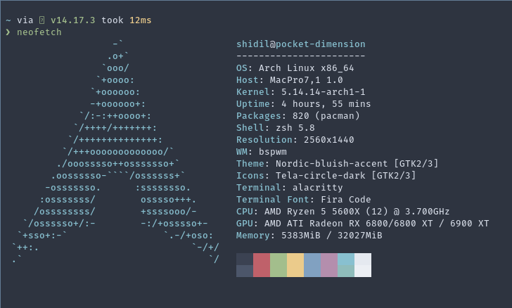

# My .Dotfiles

Current OS: Arch Linux



## Config

DE: `bspwm`
Terminal: `alacritty`
Compositor: `picom`
Launcher: `rofi`
Bar: `polybar`
Editor: `kak`
Shell: `zsh`
Prompt: `starship`

## Packages required

`feh` `bspwm` `sxhkd` `alacritty` `rofi` `dunst` `starship`

## How To

**Change Wallpaper**

```bash
wallpaper <path-to-image-file>
```

This will create a symlink to given file at ~/.wallpaper (loaded by feh at bspwm startup)